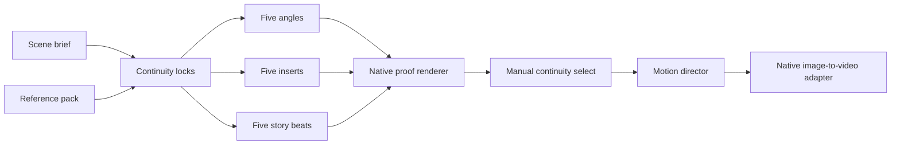

# CineForge native architecture

## Pipeline



## Components

- `cineforge/planner.py` owns the deterministic 3 × 5 shot topology.
- `cineforge/discovery.py` inventories raw model assets, standalone model packs, and the GPU directly.
- `cineforge/engine.py` owns the native queue, progress records, model lifecycle, generated media, and Diffusers adapters.
- `cineforge/server.py` persists projects and exposes the local JSON API and static UI.
- `web/` is a dependency-free browser client.

The application does not call a ComfyUI server. Generation jobs run through the CineForge Engine, which reports sampling progress, phases, elapsed time, ETA, errors, and outputs directly to the interface.

## Native model-pack contract

A runnable pack is a local Diffusers directory containing `model_index.json`. An optional `cineforge-model.json` provides a stable CineForge ID and label:

```json
{
  "id": "studio-model-v1",
  "label": "Studio Model v1"
}
```

Raw `.safetensors` files remain visible in the inventory but are not declared runnable unless they have a compatible native loader. This prevents workflow-specific FP8 and custom-node formats from being misreported as standalone models.

## Runtime safety

The server binds to `127.0.0.1`. Model and Hugging Face caches use the configured model cache on `X:`. Generated media is served only from CineForge's generated-media directory. The engine does not launch, import, modify, or contact ComfyUI.
