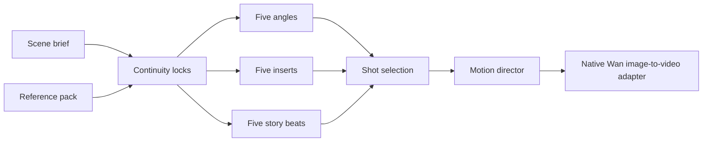

# CineForge native architecture

## Pipeline



## Components

- `cineforge/planner.py` owns the deterministic 3 × 5 shot topology.
- `cineforge/discovery.py` inventories raw model assets, standalone model packs, and the GPU directly.
- `cineforge/engine.py` owns the native queue, progress records, model lifecycle, generated media, and Diffusers adapters.
- `desktop/CineForge.Desktop/` is the native WPF window, Windows file-dialog layer, workflow UI, and live progress display.
- `cineforge/worker.py` is the bundled private engine process. It accepts newline-delimited commands through redirected standard input and returns results through redirected standard output.

The application does not call a ComfyUI server. Generation jobs run through the CineForge Engine, which reports sampling progress, phases, elapsed time, ETA, errors, and outputs directly to the native interface. The desktop executable contains no WebView and the engine never opens a listening socket.

## Native model-pack contract

A runnable pack is a local Diffusers directory containing `model_index.json`. An optional `cineforge-model.json` provides a stable CineForge ID and label:

```json
{
  "id": "studio-model-v1",
  "label": "Studio Model v1"
}
```

Raw `.safetensors` files remain visible in the inventory but are not declared runnable unless they have a compatible native loader. This prevents workflow-specific FP8 and custom-node formats from being misreported as standalone models.

## Runtime safety

The desktop interface starts the bundled engine as a hidden child process with private redirected streams. It does not bind a localhost port, serve files over HTTP, launch a browser, import ComfyUI, or contact ComfyUI. Models, cache files, inputs, projects, and generated media remain in the independently selected CineForge Library.
