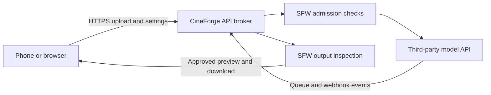

# CineForge product editions

CineForge has two planned releases. They share the same brand, responsive interface, project format, cinematic controls, progress language, and core workflow. They do not share the same inference or privacy boundary.

## Edition contract

| Capability | CineForge Desktop | CineForge Online |
| --- | --- | --- |
| Primary devices | Windows desktop | Mobile and desktop browsers |
| Inference | User's local NVIDIA GPU | Third-party video-model API |
| Client GPU requirement | Compatible dedicated NVIDIA GPU | None |
| Model delivery | Automatic local Wan download | No model download to the client |
| Storage | User-selected CineForge Library | Browser storage plus temporary moderated transfer storage |
| Connectivity | Generation works locally after model installation | Internet connection required |
| Access model | Downloadable desktop release | Free application beta; user-funded provider generation |
| Interface | Full CineForge responsive studio | Same studio adapted to small screens and touch |
| Content layer | No CineForge prompt or output moderation | SFW-only layered moderation at the hosted API boundary |

## Shared experience

Both editions retain:

- source-frame import;
- Wan image-to-video generation;
- motion, action, camera, seed, duration, resolution, and quality controls;
- dot-matrix generation monitor, framed status panel, live percentage, elapsed time, ETA, and generation phases;
- project save/load semantics and compatible project documents;
- CineForge typography, acid-green palette, micrographics, version identifier, responsive panels, and navigation;
- preview, history, and export workflows.

The user should not have to relearn CineForge when moving between editions.

## CineForge Desktop

Desktop is the private local workstation. The installer downloads the pinned Wan model pack into a user-selected CineForge Library. Generation does not call CineForge servers, ComfyUI, or Shadowframe. CineForge Desktop does not implement a prompt blacklist, an NSFW classifier, or an output moderation service. The user controls their local inputs and outputs and is responsible for lawful use, consent, privacy, likeness rights, and intellectual property.

Desktop-specific code owns local model installation, CUDA discovery, GPU telemetry, filesystem projects, native inference, and Windows packaging.

## CineForge Online

CineForge Online is a lightweight responsive client backed by a small, GPU-free CineForge API broker. It must not ship PyTorch, CUDA, Wan weights, or the local Python server to browsers. The broker protects provider credentials, applies SFW policy, submits approved requests to a third-party video-model API, receives queue/webhook events, and returns normalized progress and outputs using the same CineForge project vocabulary.

### Client hardware contract

CineForge Online never performs Wan inference on the user's phone, tablet, Chromebook, integrated laptop GPU, or desktop browser. It does not require CUDA, WebGPU, a dedicated graphics card, or enough local memory to load Wan. Ordinary browser graphics acceleration may render the interface and decode video, but it is not part of generation. CineForge also does not own or operate the generation GPU; the selected API provider supplies inference as a managed service.

The Online client is responsible only for:

- displaying the responsive CineForge interface;
- validating and uploading source media;
- submitting generation settings to the CineForge API broker;
- receiving queue state, progress, elapsed time, ETA, and errors;
- previewing, downloading, or sharing outputs that pass moderation.

The CineForge broker handles authentication, quotas, moderation orchestration, provider routing, job mapping, webhook verification, and result delivery. The selected model provider handles model loading, prompt encoding, diffusion, decoding, and output assembly on its own infrastructure. Provider API keys are server-side secrets and are never sent to the browser or mobile client.

The initial CineForge Online beta has no application access fee. Generation is not subsidized: users connect a supported third-party provider account and fund that provider directly. CineForge displays the selected provider, model, duration, resolution, unit price, and estimated total before submission, then requires explicit confirmation. There is no automatic fallback to a CineForge-funded provider account.

Capacity protection may still include accounts, per-user concurrency limits, queue limits, rate limits, output expiration, and clearly communicated availability. See [ONLINE_BILLING.md](ONLINE_BILLING.md) for the user-funded generation contract.

Because CineForge Online processes user material on hosted infrastructure, it must publish a privacy and retention policy before release. It is an SFW-only service: prompt text, reference uploads, and generated video must pass the moderation stages defined in [ONLINE_MODERATION.md](ONLINE_MODERATION.md). Online moderation belongs at the hosted service boundary and must not be compiled into or silently imposed on CineForge Desktop.

## Shared technical boundary

The interface talks to an edition-neutral generation API:

- Desktop adapter: `http://127.0.0.1` local engine and local files.
- Online adapter: authenticated HTTPS API, moderated object upload, hosted queue, progress stream, output moderation, and signed delivery.

Shared schemas cover projects, generation requests, progress events, runtime capabilities, errors, and outputs. Edition-specific operations—model installation, local path selection, hosted authentication, billing, quotas, and retention—remain outside those shared schemas.

## CineForge Online beta release gates

- responsive touch-first verification on current mobile and desktop browsers;
- successful use on devices without WebGPU or a dedicated GPU;
- a client bundle that contains no model weights or native inference runtime;
- installable PWA shell and resilient reconnect behavior;
- provider-backed queue with normalized progress, cancellation, retry, webhook verification, and failure recovery;
- server-side provider secrets with no credential exposure to clients;
- secure direct uploads and signed output delivery;
- account, quota, rate-limit, and capacity messaging;
- bring-your-own-provider connection, secret handling, cost estimate, and explicit paid-job confirmation;
- SFW prompt, reference-image, and sampled-video moderation with fail-closed handling;
- privacy, retention, deletion, acceptable-use, and incident-response documentation;
- accessibility, performance-budget, security, and abuse-resistance testing;
- clear Beta labeling separate from CineForge Desktop versioning.
